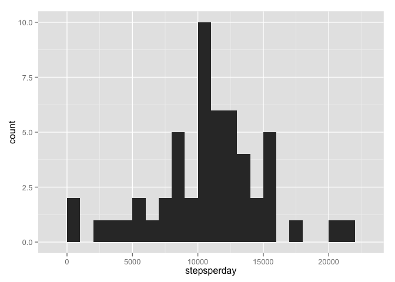
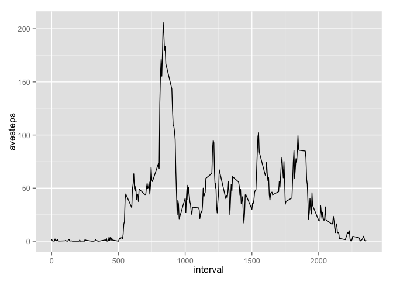
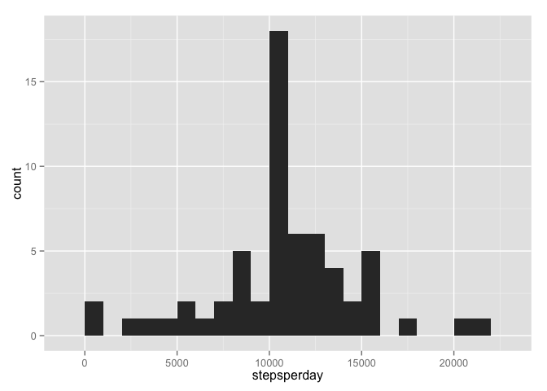
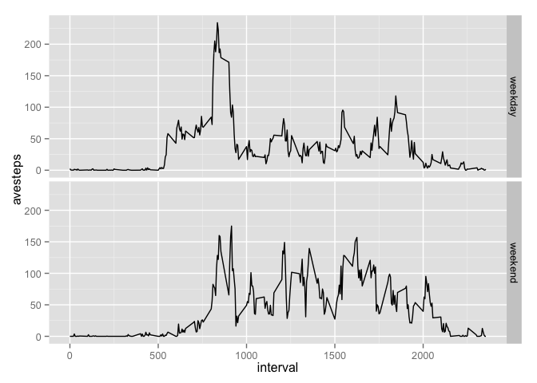

# Reproducible Research: Peer Assessment 1
Garoe Gonzalez  
## Introduction
The goal of this project is to make an analysis report using Markdown.

## Loading and preprocessing the data

We load the activity data and we have a preliminary look to the data frame. We transform the data frame into a tbl_df for easy visualization and the dplyr library to use the easy transformation functions. In addition, we store the date column as Date variable type.


```r
suppressMessages(suppressWarnings(library(dplyr)))
activity<-tbl_df(read.csv("activity.csv", stringsAsFactors = FALSE))
activity$date<-as.Date(activity$date)
str(activity)
```

```
## Classes 'tbl_df', 'tbl' and 'data.frame':	17568 obs. of  3 variables:
##  $ steps   : int  NA NA NA NA NA NA NA NA NA NA ...
##  $ date    : Date, format: "2012-10-01" "2012-10-01" ...
##  $ interval: int  0 5 10 15 20 25 30 35 40 45 ...
```

```r
activity
```

```
## Source: local data frame [17,568 x 3]
## 
##    steps       date interval
##    (int)     (date)    (int)
## 1     NA 2012-10-01        0
## 2     NA 2012-10-01        5
## 3     NA 2012-10-01       10
## 4     NA 2012-10-01       15
## 5     NA 2012-10-01       20
## 6     NA 2012-10-01       25
## 7     NA 2012-10-01       30
## 8     NA 2012-10-01       35
## 9     NA 2012-10-01       40
## 10    NA 2012-10-01       45
## ..   ...        ...      ...
```

## What is mean total number of steps taken per day?

We group the data set per day and we compute the number of steps done each day.

```r
activityPerDay <- activity %>%
     group_by(date) %>%
     summarize(stepsperday = sum(steps))
```
We plot the histogram of the results, showing the distributions of steps done per day.

```r
library(ggplot2)
ggplot (data = activityPerDay, aes(x=stepsperday)) + geom_histogram(binwidth = 1000)
```

 

We compute the mean and median of the number of steps done each day using the summarized data set.


```r
with(activityPerDay , mean  (stepsperday, na.rm = TRUE))
```

```
## [1] 10766.19
```

```r
with(activityPerDay , median(stepsperday, na.rm = TRUE))
```

```
## [1] 10765
```

## What is the average daily activity pattern?

We group the data per interval time and obtain the mean of steps over all days. 
Then we plot the time series with the interval in the x-axis and the mean steps per day in the y-axis. 


```r
TimeSeries <- activity %>%
     group_by(interval) %>%
     summarize (avesteps = mean(steps, na.rm = TRUE))
ggplot (data = TimeSeries,aes(x=interval, y=avesteps)) + geom_line()
```

 

We observed a structure in the time series. Probably intervals between 0 and 500 where the number of steps are close to 0 corresponds to resting periods of the subjects. Maximum number of steps 206, is reached at interval 835. 


```r
TimeSeries [which.max(TimeSeries$avesteps), ]
```

```
## Source: local data frame [1 x 2]
## 
##   interval avesteps
##      (int)    (dbl)
## 1      835 206.1698
```

## Imputing missing values

We calculte the number of missing values for the steps column.

```r
sum(is.na (activity$steps))
```

```
## [1] 2304
```

Since the number of NA in the raw data set is high we will replace them by the average for that specific time interval. For this we first join both results from the previous section with the raw data. Then we check if we have a NA in the steps column. If so we change the NA for the average, otherwise we keep the value. We store the results in a new dataset, activity_aproxNA. 


```r
activity_aproxNA <- inner_join (activity,TimeSeries, by = "interval") %>%
     mutate (steps = ifelse(is.na(steps), avesteps , steps))
```

We plot again the distributions of steps per day and recompute the mean and the median.


```r
activityPerDay_aproxNA <- activity_aproxNA %>% 
     group_by(date) %>%
     summarize(stepsperday = sum(steps))
ggplot (data = activityPerDay_aproxNA, aes(x=stepsperday)) + geom_histogram(binwidth = 1000)
```

 


```r
with(activityPerDay_aproxNA , mean  (stepsperday))
```

```
## [1] 10766.19
```

```r
with(activityPerDay_aproxNA , median(stepsperday))
```

```
## [1] 10766.19
```

In this case we observe that our approximation increases the peak of the previous distribution. This effect is expected because we are forcing the NA values to become the expected values and hence our central peak will be higher. In addition, a side effect is that mean and median are equal and equal to the previous mean computed withouth the NAs.

## Are there differences in activity patterns between weekdays and weekends?

We create a factor variable using the weekdays() function in our date variable.


```r
activity %>% 
     mutate (day = weekdays(date), 
             day = ifelse(day=="Sunday" | day == "Saturday", "weekend" , "weekday"),
             day = as.factor(day) ) %>%
     group_by(interval,day) %>%
     summarize (avesteps = mean(steps, na.rm = TRUE)) %>%
     ggplot (aes (x = interval, y = avesteps)) + geom_line() +
     facet_grid( day ~ .)
```

 

We can conclude from the plot that it exists a difference between weekdays and weekends. The peak at around the interval 800 do not appears during weekends, indicating a pattern associated with working days, e.g. walk to work. 
